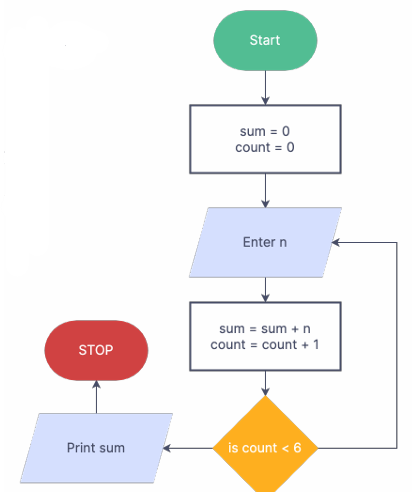
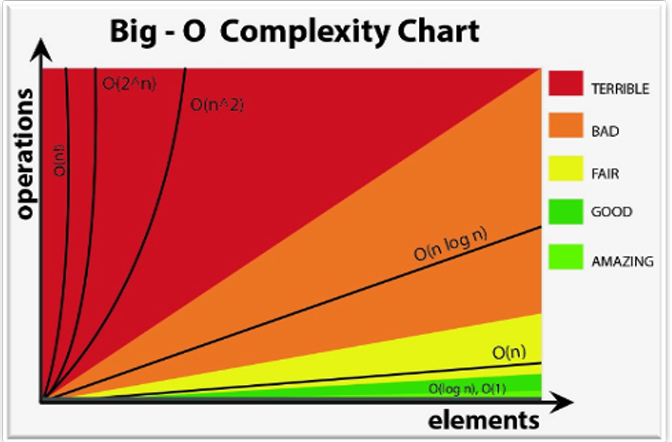

# 1101091 STRUCTURED PROGRAMMING AND DATA STRUCTURES

## Array & Analysis of Algorithm

### Algorithm

อัลกอริทึมคือลำดับขั้นตอนการคำนวณที่นิยมที่จะแปลงข้อมูลขาเข้าเป็นข้อมูลผลลัพธ์ (Cormen, 2009)

Ex.

ขั้นตอนการหาผลรวมของ 6 ตัวเลขมีดังนี้:

1. เริ่มต้นโดยกำหนดค่าเริ่มต้นของผลรวม (sum) เป็น 0 และตัวนับ (count) เป็น 0.
2. รับค่าตัวเลข (n) จากผู้ใช้.
3. คำนวณผลรวมโดยนำค่า n มาบวกกับผลรวม (sum) และเพิ่มค่าตัวนับ (count) ขึ้น 1.
4. ตรวจสอบเงื่อนไขว่า count < 6 หากเป็นเช่นนั้นกลับไปทำขั้นตอนที่ 2 หากไม่เช่นนั้น พิมพ์ผลรวม (sum).

---

### Big-O Notation

Big-O notation เป็นการแสดงความซับซ้อนของอัลกอริทึมโดยใช้ฟังก์ชันของขนาดของข้อมูลเข้าเป็นตัวแทนทางคณิตศาสตร์


1. Algorithmic Complexity - O(n)
   
   `````
   For i = 1 To n 
     Array[i] = 10?
   Next i
   `````
   
   or
   
   `````
   For i = 1 To n + 1
     Array[i] = 10?
   Next i
   `````
2. Algorithmic Complexity - O(2n)
   
   ````
   For i = 1 To n 
     Array[i] = 10?
   Next i
   For i = 1 To n 
     Array[i] = 10?
   Next i
   `````
3. Algorithmic Complexity - O(n2)
   
   `````
   For i = 1 To n
     For j = 1 To n
       Array[i][j] = 10?
     Next j
   Next i
   `````
4. Algorithmic Complexity - O(n3)
   
   ```
   For i = 1 To n
     For j = 1 To n
       For k = 1 To n
         Array[i][j] = 10?
       Next k
     Next j
   Next i
   ```


